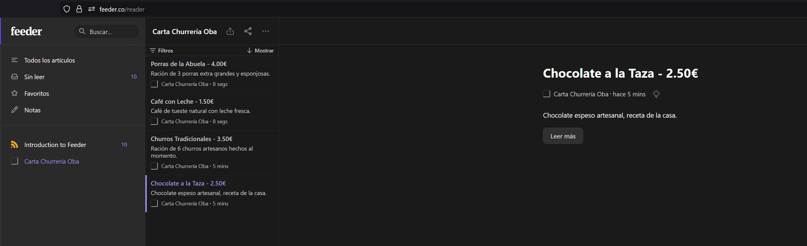

# 🌙 Churrería Oba

A modern dark-themed website built with React and Vite for a classic Spanish churrería.  
Browse our products, learn about us, and get in touch.

---

## 🌐 Live Demo
You can view the live application deployed here:  
**[https://reactfirebasesimpleexample.web.app/](https://reactfirebasesimpleexample.web.app/)**

---

## 🚀 Getting Started

### Prerequisites
- Node.js (v16+ recommended)
- npm

### Installation
```bash
git clone https://github.com/ObaldaiFernandezGazulla/Proyecto-React-1.git
npm install
npm run dev
```

Open:  
http://localhost:5173

---

## 📁 Project Structure

```
churreria-oba/
├── public/
│   ├── logo-oba.png
│   ├── about-local.jpg
│   ├── about-churros.jpg
│   └── carta.xml           
├── src/
│   ├── components/
│   │   ├── header/
│   │   ├── footer/
│   │   └── destination-card/
│   ├── pages/
│   │   ├── home/
│   │   ├── about/
│   │   ├── contact/
│   │   ├── reviews/        
│   │   ├── menu/         
│   │   ├── privacy/  
│   │   ├── cookies/   
│   │   └── terms/        
│   ├── data/
│   │   └── destinations.js
│   ├── services/
│   │   ├── reviews.service.js
│   │   └── firebase.js
│   ├── utils/
│   │   ├── file-export.js
│   │   └── file-import.js
│   ├── App.jsx
│   ├── index.css
│   └── main.jsx
└── README.md
```

---

## 🎨 Main Features

### Home Page
- Hero section with a modern dark café aesthetic
- Product cards loaded from a JSON array
- Fully responsive using flexbox
- Smooth hamburger menu on mobile devices

### About Page
- Story of the churrería
- Two high-quality images (local + churros)
- Well-structured text blocks

### Contact Page
- Interactive Leaflet map centered on **Paseo González Díaz nº 15, Teror**
- Contact information and schedule
- Contact form with name, email, and message fields

# Reviews

### Funcionalidades principales
- Create: Permite a los usuarios añadir nuevas reseñas al sistema mediante un formulario validado.
- Read: Sincronización en tiempo real con Firebase Realtime Database para mostrar la lista de opiniones.
- Update: Capacidad de modificar usuario, valoración y comentarios, con validación de integridad de datos.
- Delete: Eliminación de registros con actualización automática del estado del componente.

### Gestión de Datos y Archivos
- Importación: Soporte para cargar datos desde archivos externos (**JSON, CSV y XML**). El sistema normaliza el contenido y lo persiste automáticamente en la base de datos.
- Exportación: Generación de backups o reportes en formatos **JSON, CSV y XML**, permitiendo al usuario descargar su historial de reseñas localmente.
- Arquitectura de Servicios: Acceso a Firebase centralizado en la capa `services/` para asegurar un desacoplamiento eficiente entre la lógica de negocio y la interfaz.

### Experiencia de Usuario (UX)
- Interfaz Fluida: Uso de un Modal personalizado para la edición de reseñas, eliminando el uso de ventanas nativas bloqueantes (`prompt`).
- Notificaciones: Sistema de *toasts* (notificaciones no intrusivas) para feedback inmediato tras operaciones de importación, exportación o edición.
- Asincronía: Implementación de patrones `async/await` para evitar el bloqueo del hilo principal durante las llamadas a la base de datos o el procesamiento de archivos.

### Archivos de ejemplo para importación
Para facilitar el uso de la funcionalidad de importación, el sistema permite descargar plantillas de prueba en los formatos soportados:
- [Descargar template.json](https://drive.google.com/file/d/1T2Fgs4H7ulf51pkSGMXOuqEUs_S_7V3D/view?usp=sharing)
- [Descargar template.csv](https://drive.google.com/file/d/1gPYvlLp8ZrO-7ALDTH76pafCygKkMDLV/view?usp=sharing)
- [Descargar template.xml](https://drive.google.com/file/d/1PiekiehfQF5AHIoBH3amrQng3gl-BTe_/view?usp=sharing)

# Menu
Detailed product page.
RSS feed: official feed via carta.xml for products and prices.

# RSS Feed Reader Integration
The RSS feed integration has been verified using an external reader, linking each product in the menu to the official URL of the project hosted on Firebase.



---

## 🛠️ Third-Party Components

### Firebase Hosting
Project deployed and managed via Firebase infrastructure for public and secure access.

### Leaflet
Used for the interactive map on the Contact page.  
https://react-leaflet.js.org/  
https://leafletjs.com/examples/quick-start/

### React Icons
Used for social media icons in the footer.  
https://react-icons.github.io/react-icons/

---

## 📚 Resources That Helped

- React Docs — https://react.dev/
- Vite Guide — https://vitejs.dev/guide/
- React Router — https://reactrouter.com/
- CSS Flexbox Guide — https://css-tricks.com/snippets/css/a-guide-to-flexbox/
- Unsplash — https://unsplash.com/
- README Template — https://github.com/othneildrew/Best-README-Template

---

## 💻 Git Workflow

Branches:
- main — Production
- develop — Development

```bash
git checkout develop
git add .
git commit -m "your message"
git push origin develop

---

## 👤 Author

**Obal-dai Fernández Gazulla**  
GitHub: https://github.com/obaldai

---

## 🙌 Thanks To

- React Icons
- Leaflet
- CSS-Tricks
- MDN Web Docs
